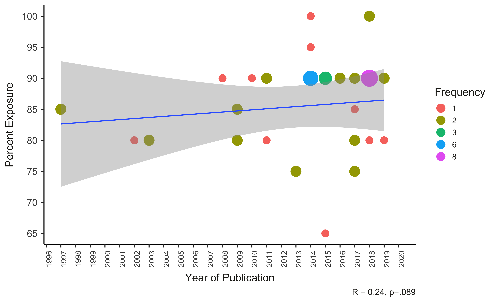

---
output:
  word_document: default
---

```{r load_packages_settings, include = FALSE}
library(papaja)
library(ggthemes)
library(lme4)
library(tidyverse)
library(here)
library(knitr)
library(kableExtra)
library(english)
library(PRISMAstatement)
library(DiagrammeR)
library(vtree)
library(wesanderson)
library(reshape2)  
library(viridis)
library(ggpubr)
library(waffle)

opts_chunk$set(echo = FALSE, warning = FALSE, message = FALSE, cache = TRUE)
theme_set(theme_bw() + 
            theme(strip.background = element_blank(), 
                  panel.grid = element_blank())) # nice theme with limited extras
```

```{r load_data}
data <- read_csv("Step2_data/step2_data.csv")
```

```{r}
total_papers <- data %>%
  summarise(n = length(unique(code))) 

total_studies <- data %>%
  summarise(n = length(code)) 

bi_def_present <- data %>%
  group_by(bi_def_present) %>%
  summarise(n = length(bi_def_present)) 

mono_def_present <- data %>%
  group_by(mono_def_present) %>%
  summarise(n = length(mono_def_present)) 

bi_measure <- data %>%
  group_by(bi_measure) %>%
  summarise(n = length(bi_measure)) 

```

## Inter-coder reliability

Table 1

```{r}
Kappa <- c(0.931,0.869,0.828 ,0.767,0.914,0.832) 

variables <- c("Monolingual sample size", "Bilingual sample size", "Monolingual definition (binary)", "Bilingual definition (binary)", "Monolingual cutoff", "Bilingual cutoff")
kappa_data <- data.frame(variables,Kappa)

papaja::apa_table(kappa_data, format.args = list(digits = 2),
                  caption = "Inter rater reliabilty for full paper data extraction",
                  note = "All Cohen's Kappas had a p < .001.",
                  col.names =c("**Variables**","**Cohen's Kappa value**"),
                  align=c("l","c"),
                  landscape=FALSE)
```

# Results

Coder excluded `r 106+30+10+2+8+33+1` papers for not being empirical, 97 papers for not being relevant, `r 27+2+4` for reporting being metanalyses/monographs/dissertations, and 55 papers for focusing on children older than 3 years old, not traditionally developing (`r 22`), or for growing up as multimodal bilinguals (`r 6`). You can find the complete table for all studies in Appendix 1 including information about language categorization and measures utilized.

```{r fig1, fig.cap="Flow diagram of the study selection process."}
 knitr::include_graphics("Figures/Figure 1.png")
```

```{r}
data <- data %>%
  mutate(Country = case_when(
    country == "Canadian city" ~ "Canada",
    country == "Argentina,South Korea,United States" ~ "Across multiple countries",
    country == "Singapore,Malaysia" ~ "Across multiple countries",
    country == "Spain,United States" ~ "Across multiple countries",
    country == "Switzerland,Canada" ~ "Across multiple countries",
    country == "United States,Canada"  ~ "Across multiple countries",
    country == "United States,Germany"  ~ "Across multiple countries",
    country == "Canada,United States"    ~ "Across multiple countries",
    country == "Canada,Switzerland"  ~ "Across multiple countries",
    TRUE ~ country
  ))

countries <- data %>%
  group_by(Country) %>%
  dplyr::summarise(N = n()) %>%
  ungroup %>%
  arrange(desc(N))

countries[2,2]

#unique(countries$Country)
```
## Q1. Who Is Included in Studies of Bilingual Infants?

### Q1a. Where do bilingual populations come from?

A total of 38 studies did not provide information about the geographic location for their participants' recruitment. From the studies that did provide information (either explicitly within text or part of their acknowledgment/notes), the majority of them were conducted in the United States (`r countries[2,2]`), Canada (`r countries[3,2]`), or Spain (`r countries[4,2]`). Eight studies reported having samples from multiple countries. For example, Cote and Bornstein (2014) recruited bilingual samples in the United States but monolingual samples from the United States, South Korea, and Argentina. Two other studies (Legacy et al., 2016; Legacy et al., 2018) recruited monolinguals from Geneva, Switzerland, while the bilingual groups were recruited from a Montreal, Canada (for more details see Appendix 1).

```{r}

papaja::apa_table(countries, format.args = list(digits = 1),
                  caption = "Frequency of Geographic Locations Reported in Studies",
                  note = "N refers to the number of studies that reported collecting data from this location.",
                  col.names =c("**Country**","**N**"),
                  align=c("l","c"),
                  landscape=TRUE)
```

Geographic Graph:

```{r fig4, fig.cap="Countries where bilingual samples were recruited and their languages. A total of 38 studies did not provide geographic information for their sample"}
 
```

### Q1b. What languages are included in the developmental bilingual literature?

```{r}

data$eng_lang <- str_detect(data$languages,"English")
data$spn_lang <- str_detect(data$languages,"Spanish")
data$frn_lang <- str_detect(data$languages,"French")
data$x_lang <- str_detect(data$languages,"Other")
data <- data %>%
  mutate(eng_lang = case_when(
    eng_lang == TRUE ~ 1,
    eng_lang == FALSE ~ 0))

eng_lang <- data %>%
  group_by(eng_lang) %>%
  summarise(N = n()) %>%
  ungroup %>%
  arrange(desc(eng_lang)) 

spn_lang <- data %>%
  group_by(spn_lang) %>%
  summarise(N = n()) %>%
  ungroup %>%
  arrange(desc(spn_lang)) 

frn_lang <- data %>%
  group_by(frn_lang) %>%
  summarise(N = n()) %>%
  ungroup %>%
  arrange(desc(frn_lang)) 

x_lang <- data %>%
  group_by(x_lang) %>%
  summarise(N = n()) %>%
  ungroup %>%
  arrange(desc(x_lang)) 
    
language_pairs <- data %>%
  group_by(languages) %>%
  summarise(N = n()) %>%
  ungroup %>%
  arrange(desc(N))
#language_pairs
#unique(countries$Country)
```

Only four studies did not provide information about their bilingual's language pairs. Not surprisingly, the majority of the bilingual groups had English as one of the languages of interest (`r eng_lang[1,2]` studies), followed by Spanish (`r spn_lang[1,2]` studies), and French (`r frn_lang[1,2]` studies). While `r x_lang[2,2]` studies restricted their bilingual sample to one type of language pair (e.g. English-Spanish, Spanish-Catalan), `r x_lang[1,2]` studies focused on more diverse bilinguals.

```{r}
papaja::apa_table(language_pairs, format.args = list(digits = 1),
                  caption = "Frequency of Language Pairs Reported in Studies",
                  note = "N refers to the number of studies that reported collecting data from this location.",
                  col.names =c("**Language Pairs**","**N**"),
                  align=c("l","c"),
                  landscape=TRUE)
```


## Q2. How are bilinguals (and monolinguals) defined in the developmental literature?

### Q2a. What are the most common measures used to define bilinguals?

```{r}
data$bi_measure <- as.character(data$bi_measure)
data <- data %>%
  mutate(bi_measure = case_when(
    bi_measure == "MAPLE" ~ "Multilingual Approach to Parent Language Estimates (MAPLE; Byers-Heinlein et al., 2019)",
    bi_measure == "Language background questionnaire"  ~ "Language Background questionnaire (source not specified)",
    bi_measure == "own questionnaire"  ~ "Own Questionnaire",
    bi_measure == "single question"  ~ "Single Question",
    bi_measure == "The Language Exposure Assessment Tool (DeAnda, Bosch, Poulin- Dubois, Zesiger, & Friend, 2016)" ~ "The Language Exposure Assessment Tool (LEAT; DeAnda, Bosch, Poulin-Dubois, Zesiger, & Friend, 2016)" ,
    bi_measure == "Multilingual Infant Language Questionnaire (Liu & Kager, 2016)"  ~ "Multilingual Infant Language Questionnaire (MILQ; Liu & Kager, 2016)" ,
    bi_measure == "Language Social Background Questionnaire (LSBQ, adapted from Anderson Mak, Chahi, & Bialystok, 2018)" ~ "Language Social Background Questionnaire (LSBQ; adapted from Anderson Mak, Chahi, & Bialystok, 2018)",
    bi_measure == "UBiLEC (Utrecht Bilingual Language Exposure Calculator, Unsworth, 2013)"  ~ "Utrecht Bilingual Language Exposure Calculator (UBiLEC; Unsworth, 2013)",
    bi_measure == "English/Spanish bilingual background questionnaire (Garcia-Sierra et al., 2009; Garcia-Sierra et al., 2012)"  ~ "English/Spanish Bilingual Background Questionnaire (Garcia-Sierra et al., 2009; Garcia-Sierra et al., 2012)",
    bi_measure == "Home Language Environment Questionnaire (HLEQ) Marchman and colleagues (2004)"  ~ "Home Language Environment Questionnaire (HLEQ; Marchman et al., 2004)",
    bi_measure == "Parent language survey (Conboy, 2002)" ~ "Bilingual Questionnaire (Conboy, 2002)",
    bi_measure == "Bilingual questionnaire (Conboy, 2002;Conboy & Mills, 2006)" ~ "Bilingual Questionnaire (Conboy, 2002)",
    bi_measure == "Bilingual Language Background and Use Questionnaire (‘‘BLBUQ;’’ see Holowka, Brosseau-Lapré, & Petitto, 2002)"  ~ "Bilingual Language Background and Use Questionnaire (BLBUQ; Holowka, Brosseau-Lapré, & Petitto, 2002)",
    bi_measure == "Adapted from  Bosch & Sebastián‐Gallés, 2001; DeAnda et al., 2016 + LENA" ~ "Multilingual Approach to Parent Language Estimates (MAPLE; Byers-Heinlein et al., 2019)",
    bi_measure == "no specified"  ~ "Non Specified" ,
    TRUE ~ bi_measure
  ))

measures_table <- data %>%
  group_by(bi_measure) %>%
  summarise(N = n(),
            Percent = round((N*100)/167, 2)) %>%
  ungroup %>%
  arrange(desc(N))

data$citation<- as.character(data$citation)

citations <- colsplit(data$citation,  "[)]", names =  c('Studies','Titles'))

data$articles <- paste(citations$Studies,")", sep = "")

```
### Q2b. How Often Do Researchers Provide an Operational Definition of their Language Groups?

#### Monolinguals

```{r}
mono_def <- data %>%
  group_by(mono_def_present) %>%
  summarise(N = n()) %>%
  ungroup %>%
  arrange(desc(mono_def_present)) 

perc_pres_m <- round(((mono_def[1,2]*100)/(mono_def[1,2] + mono_def[2,2])),2)
perc_no_pres_m <- round(((mono_def[2,2]*100)/(mono_def[1,2] + mono_def[2,2])),2)


data <- data %>%
  mutate (mono_concept = case_when(
    mono_concept == "idk" ~"Can't Be Determined",
    TRUE ~ mono_concept
  ))


mono_concept<- data %>% 
  filter(mono_def_present == "Present") %>%
  group_by(mono_concept) %>%
  summarise(N = n(),
            Percent = round((N*100)/72, 2)) %>%
  ungroup %>%
  arrange(desc(N)) 

mono_concept_no_definition <- data %>% 
  filter(mono_concept != 999,mono_def_present == "Not Present") %>%
  group_by(mono_concept) %>%
  summarise(N = n(),
            Percent = round((N*100)/39, 2)) %>%
  ungroup %>%
  arrange(desc(N)) 
```

**Monolinguals**. From the 167 eligible studies, `r mono_def[1,2] + mono_def[2,2]` of them included a a monolingual group. From this, `r perc_pres_m`% (`r mono_def[1,2]` studies) of them offered some sort of definition for their monolingual group.


####Bilinguals
```{r}
bi_def <- data %>%
  group_by(bi_def_present) %>%
  summarise(N = n()) %>%
  ungroup %>%
  arrange(desc(bi_def_present)) 
perc_pres_b <- round(((bi_def[1,2]*100)/(bi_def[1,2] + bi_def[2,2])),2)
perc_no_pres_b <- round(((bi_def[2,2]*100)/(bi_def[1,2] + bi_def[2,2])),2)


data <- data %>%
  mutate (bi_concept = case_when(
    bi_concept == "Can't be determined" ~"Can't Be Determined",
    TRUE ~ bi_concept
  ))


bi_concept<- data %>%
  filter(bi_concept != 999,bi_def_present == "Present") %>%
  group_by(bi_concept) %>%
  summarise(N = n(),
            Percent = round((N*100)/144, 2)) %>%
  ungroup %>%
  arrange(desc(N)) 

```

**Bilinguals**. The majority of the studies offered some sort of definition for their bilingual group (`r perc_pres_b`%, `r bi_def[1,2]` studies). If the document provided enough information about its measures, we were able to deduce the type of concept measured to help the experimenter classify children as bilingual. We found "Percent or hours exposure to a second language" to be the most common concept measured (`r bi_concept[1,2]`), followed by "Caregiver status" (`r bi_concept[2,2]`; defined as bilinguals if caregivers or home was bilingual), another one utilized "Child's Vocabulary", and six were not possible to be determined (See Table 3).

```{r}
# bi_concept
papaja::apa_table(bi_concept, format.args = list(digits = 2),
                  caption = "Frequency of Concepts Measured to Classify Bilinguals",
                  note = "N refers to the number of studies that reported enough information about the concept being measured.",
                  col.names =c("**Concept Measured**","**N**","**Perc**"),
                  align=c("l","c","c"),
                  landscape=TRUE)

```

### Q1c. For studies where researchers have estimated language exposure, how much exposure is enough to meet monolingual/bilingual inclusion?

```{r}
order2 <- c("None", "65%","75%","80%","85%","90%","95%","100%")		

mono_cutoff_table<- data %>%
  mutate(cutoff_mono = case_when(
    cutoff_mono == "95% (100% for SPN group)" ~ "95%",
    TRUE ~ cutoff_mono)) %>%
  filter(mono_def_present == "Present") %>%
  group_by(cutoff_mono) %>%
  summarise(N = n(),
            Percent = round((N*100)/72, 2)) %>%
  ungroup %>%
  slice(match(order2, cutoff_mono)) %>%
  rename("Cutoff" = "cutoff_mono")
```

##### Figure
```{r}
mono_cutoff_table$Cutoff <- as.factor(mono_cutoff_table$Cutoff)
mono_cutoff_table %>%
  filter(str_detect(Cutoff, "%")) %>%
  ggplot(aes(x=Cutoff, y=N,fill=Cutoff)) +
  geom_bar(stat="identity",position=position_dodge())+
  geom_text(aes(label=N), vjust=-0.3, color="Black",
            position = position_dodge(0.9), size=4.5)+
  scale_fill_discrete(guide=FALSE) +
  theme(  axis.title.x = element_text(size=350,face='bold'),
          axis.title.y = element_text(size=350,face='bold'),
          text = element_text(size=350,face='bold'))+
  labs(x = "Cutoff",
        y = "Frequency of Studies") +
  scale_y_continuous(breaks = seq(0, 50, by = 2)) +
  scale_x_discrete(limits=c("65%", "75%", "80%","85%","90%","95%","100%")) + theme_apa()

ggsave("Figures/Figure 3.png", width = 18, height = 13, units = "cm")
```

```{r fig12, fig.cap="Frequency of studies by cutoffs utilized."}

```

##### Table

```{r}
 papaja::apa_table(mono_cutoff_table, format.args = list(digits = 2),
                   caption = "Frequency of Cutoffs Utilized to Classify Monolinguals",
                   note = "Cutoff refers to the minimun amount exposure utilized to classify monolinguals.",
                   col.names =c("**Cutoff**","**N**","**Percent**"),
                   align=c("l","c","c"),
                   landscape=TRUE)
```


#### Bilinguals
```{r}
order1 <- c("None", "8hrs","10hrs","20hrs", "10%" ,"15%","20%","21%" ,"25%","30%","35%","40%")

bi_cutoff_table<- data %>%
  filter(bi_def_present == "Present" & bi_concept == "Exposure" | bi_concept == "Exposure+LENA" ) %>%
  group_by(cutoff_bi) %>%
  summarise(N = n(),
            Percent = round((N*100)/123, 2)) %>%
  ungroup %>%
  slice(match(order1, cutoff_bi)) %>%
  rename("Cutoff" = "cutoff_bi")

```


```{r}
measures_cutoffs <- data %>%
  select(bi_measure, cutoff_bi) %>%
  group_by(bi_measure) %>%
  count(cutoff_bi)
```

##### Figure

```{r include=FALSE}
#graphs for both mono and bilinguals
bi_cutoff_table$Cutoff <- as.factor(bi_cutoff_table$Cutoff)
bi_cutoff_table %>%
  filter(str_detect(Cutoff, "%")) %>%
  ggplot(aes(x=Cutoff, y=N,fill=Cutoff)) +
  geom_bar(stat="identity",position=position_dodge())+
  geom_text(aes(label=N), vjust=-0.3, color="black",
            position = position_dodge(0.9), size=4.5)+
  scale_fill_discrete( guide=FALSE) +
  theme( axis.title.x = element_text(size=350,face='bold'),
          axis.title.y = element_text(size=350,face='bold'),
          text = element_text(size=350,face='bold'))+
  labs(x = "Cutoff",
        y = "Frequency of Studies") +
  scale_y_continuous(breaks = seq(0, 50, by = 2)) + theme_apa()

ggsave("Figures/Figure 4.png", width = 18, height = 13, units = "cm")

```

```{r fig11, fig.cap="Frequency of studies by cutoffs utilized."}

```

##### Table
```{r}
papaja::apa_table(bi_cutoff_table, format.args = list(digits = 2),
                  caption = "Frequency of Studies by Cutoffs Utilized to Classify Bilinguals",
                  note = "Cutoff refers to the minimun amount exposure utilized to classify bilinguals (the hr cutoffs are per week).",
                  col.names =c("**Cutoff**","**N**","**Percent**"),
                  align=c("l","c","c"),
                  landscape=TRUE)
```


Out of 124 studies that reported a definition, `r bi_cutoff_table[1,2]` did not provide a min exposure requirement for the bilingual group. Two percentages were similarly used by the literature, `r bi_cutoff_table[8,2]` studies used *"25%"* as their minimum requirement for the child's second language (L2), `r bi_cutoff_table[7,2]` studies used *"20%"* as their cut off. Next in line we have *"30%"* used by `r bi_cutoff_table[9,2]` studies, *"35%"* used by `r bi_cutoff_table[10,2]` studies, *"10%"* used by `r bi_cutoff_table[5,2]` studies, and *"40%"* used by `r bi_cutoff_table[11,2]` studies (see Table 4).

### Q1d. Do the various cut-offs utilized vary across time?

```{r}
data$bi_min <- as.numeric(str_replace_all(data$cutoff_bi,"%",""))
data$mono_min <- as.numeric(str_replace_all(data$cutoff_mono,"%",""))

```

#### Monolinguals
```{r}

data_q1c_mono <-data %>%
  filter(mono_def_present == "Present") 

#Pearsons correlation for year and perc exposure
ggscatter(data_q1c_mono, x = "year", y = "mono_min",
          add = "reg.line", conf.int = TRUE,
          cor.coef = TRUE, cor.method = "pearson",
          xlab = "Year of Publication", ylab = "Minimun Exposure in %")
data %>%
  filter(mono_def_present == "Present" & str_detect(cutoff_mono, "%")) %>%
  group_by(mono_min, year) %>%
  summarise(N = n()) %>%
  ungroup() %>%
  arrange(N) %>%
  mutate(N = as.factor(N)) %>%
  ggplot(aes(x=year, y=mono_min)) +
  geom_point(aes(size=N,color=N),shape=19, stroke=FALSE) +
  geom_smooth(method=lm) +
  scale_fill_viridis(option="magma", name="Frequency of studies" ) +
  scale_size_discrete(range=c(7,15), guide = FALSE) +
  scale_color_discrete(name="Frequency" ) +
  theme_apa(base_size = 20)+
  theme(text = element_text(color = "#22211d"), legend.text=element_text(size=15),
          axis.text.x = element_text(size=14,angle = 90, hjust = 1))+
  guides(color = guide_legend(override.aes = list(size = 8))) +
  labs(x = "Year of Publication",
        y = "Percent Exposure",
       caption = "R = 0.24, p=.089") +
  scale_x_continuous(breaks = seq(1993, 2020, by = 1)) +
  scale_y_continuous(breaks = seq(0, 100, by = 5))

ggsave("Figures/Figure 6.png", width = 33, height = 20, units = "cm")

```

```{r fig5, fig.cap="Percent exposure cutoffs by year of publication."}

```

Table for year averages

```{r}
mono_cutoff_table_years<- data %>%
  filter(cutoff_mono=="None" & mono_def_present == "Present") %>%
  group_by(year) %>%
  summarise(N = n()) 

```

```{r}

papaja::apa_table(mono_cutoff_table_years, format.args = list(digits = 2),
                  caption = "Summary of Frequency of Studies by year and cutoffs for monolinguals",
                  col.names =c("**Year**","**N**"),
                  align=c("l","c"),
                  landscape=TRUE)
```

#### Bilinguals
```{r}
data_q1c_bi <-data %>%
  filter(str_detect(cutoff_bi, "%")) 
# Pearsons correlation for year and perc exposure
ggscatter(data_q1c_bi, x = "year", y = "bi_min",
          add = "reg.line", conf.int = TRUE,
          cor.coef = TRUE, cor.method = "pearson",
          xlab = "Year of Publication", ylab = "Minimun Exposure in %")

#cut off per year graph for bilinguals
data %>%
  filter(str_detect(cutoff_bi, "%")) %>%
  group_by(bi_min, year) %>%
  summarise(N = n()) %>%
  ungroup() %>%
  arrange(N) %>%
  mutate(N = as.factor(N)) %>%
  ggplot(aes(x=year, y=bi_min)) +
  geom_point(aes(size=N,color=N),shape=19, stroke=FALSE) +
  geom_smooth(method=lm) +
  scale_fill_viridis(option="magma", name="Frequency of studies" ) +
  scale_size_discrete(range=c(7,15), guide = FALSE) +
  scale_color_discrete(name="Frequency" ) +
  theme_apa(base_size = 20)+
  theme(text = element_text(color = "#22211d"), legend.text=element_text(size=15),
          axis.text.x = element_text(size=14,angle = 90, hjust = 1))+
  guides(color = guide_legend(override.aes = list(size = 8))) +
  labs(x = "Year of Publication",
        y = "Percent Exposure",
       caption = "R = -.41, p<.001") +
  scale_x_continuous(breaks = seq(1993, 2020, by = 1)) +
  scale_y_continuous(breaks = seq(0, 50, by = 5))

ggsave("Figures/Figure 5.png", width = 33, height = 20, units = "cm")

```
```{r fig4, fig.cap="Percent exposure cutoffs by year of publication."}

```

```{r}
bi_cutoff_table_years<- data %>%
  filter(cutoff_bi=="None" & bi_def_present == "Present" & bi_concept == "Exposure" | bi_concept == "Exposure+LENA" ) %>%
  group_by(year) %>%
  summarise(N = n()) 
```

```{r}
papaja::apa_table(bi_cutoff_table_years, format.args = list(digits = 2),
                  caption = "Summary of Frequency of Studies by year and cutoffs for bilinguals",
                  col.names =c("**Year**","**N**"),
                  align=c("l","c"),
                  landscape=TRUE)
```

### Q1e. Are there gaps in the cut-offs? How much is too little L2 to be categorized?


```{r}
data$gap <- data$bi_min-(100-data$mono_min)
drops <-data%>%
  filter(mono_def_present == "Present" & bi_def_present == "Present") %>%
  group_by(gap) %>%
  summarise(N = n())
```

#### Figure

```{r}
#graphs for both mono and bilinguals
drops$gap<- as.factor(drops$gap)
drops %>%
  filter(gap!="NA") %>%
  ggplot(aes(x=gap, y=N,fill=gap)) +
  geom_bar(stat="identity",position=position_dodge())+
  geom_text(aes(label=N), vjust=-0.3, color="black",
            position = position_dodge(0.9), size=8.5)+
  scale_fill_discrete(guide=FALSE) +
  theme_apa(base_size = 20)+
  labs(x = "L2 % Cutoff Gap (Monolinguals vs. Bilinguals)*",
        y = "Frequency of Studies",
       caption = "*L2 % Cutoff - (100-L1 % Cutoff)") +
  scale_y_continuous(breaks = seq(0, 50, by = 2))

ggsave("Figures/Figure 7.png", width = 33, height = 25, units = "cm")
```

```{r fig13, fig.cap="Frequency of studies."}

```

#### Table
```{r}

papaja::apa_table(drops, format.args = list(digits = 2),
                  caption = "Summary of Frequency of Studies based on the window between being defined bilingual or monolingual calculated by substracting the Monolingual L2 min from the Bilingual L2 min",
                  col.names =c("**Gap**","**N**"),
                  align=c("l","c"),
                  landscape=TRUE)
```


## Q3. Can We Predict Bilingual Differences Using Bilingual’s L2 Cut-offs?

```{r}
#data cleaning for the diff column
unique(data$if.comparing..diff.)


data$compare <- data$if.comparing..diff.
data <- data %>%
  mutate(difference=case_when(
    compare == "no" ~ "No",
    compare == "kinda"  ~ "Yes",
    compare == "yes" ~ "Yes",
    compare == "Yes"  ~ "Yes",
    TRUE ~ compare
  ))
data$difference <- as.factor(data$difference)
```

### Figure

```{r}
data %>%
  filter(difference != 999 & str_detect(cutoff_bi, "%")) %>%
  group_by(bi_min,year,difference) %>%
  summarise(N = n()) %>%
  ungroup() %>%
  arrange(N) %>%
  mutate(N = as.factor(N)) %>%
  ggplot(aes(x=year, y=bi_min)) +
  geom_point(aes(size=N,color=difference), stroke=FALSE) +
  scale_size_discrete(range=c(7,15), name="Frequency", guide=FALSE) +
  theme_apa(base_size = 20)+
  theme(text = element_text(color = "#22211d"), legend.text=element_text(size=15),
          axis.text.x = element_text(size=14,angle = 90, hjust = 1))+
  guides(color = guide_legend(override.aes = list(size = 8))) + 
  labs(x = "Year of Publication",
        y = "Percent Exposure",
       colour = "Differences\nPresent",
       caption = "*Only includes studies that had both monolingual and bilingual groups") +
  scale_x_continuous(breaks = seq(1993, 2020, by = 1)) +
  scale_y_continuous(breaks = seq(0, 50, by = 5)) 


 ggsave("Figures/Figure 8.png", width = 33, height = 20, units = "cm")

```

This graph is for frequency of studies by year and % of bilinguals excluding studies that did not have monolinguals

```{r fig7, fig.cap="Percent exposure cutoffs by year of publication."}

```


### Table

```{r}
diff_table <- data %>%
  mutate(cutoff_mono = case_when(
    cutoff_mono == "95% (100% for SPN group)" ~ "95%",
    TRUE ~ cutoff_mono)) %>%
  group_by(difference)%>%
  summarise(N = n(),
            Percent = round((N*100)/167, 2)) %>%
  ungroup %>%
  arrange(desc(difference))
```

```{r}
#Cleaning this table:

papaja::apa_table(diff_table, format.args = list(digits = 2),
                  caption = "Summary of Frequency of Studies that Reported a Difference",
                  note = "Code 999=Studies that did not have a monolingual group",
                  col.names =c("**Reported a Difference**","**N**","**Percent**"),
                  align=c("l","c","c"),
                  landscape=TRUE)
```

## Supplemental Material A
```{r}
review_table <- data %>%
  select(articles,study_num,age_group,country,groups,languages,mono_def_present,bi_def_present,bi_measure,cutoff_mono,cutoff_bi) %>%
  rename( "Articles" = "articles",
          "Study #"="study_num",
          "Age Group" = "age_group",
          "Location" = "country" ,
          "Language Groups" = "groups" ,
          "Language Pairs" = "languages",
          "Monolingual Definition" = "mono_def_present",
          "Bilingual Definition" = "bi_def_present",
          "Bilingual Measure" = "bi_measure",
          "Monolingual Cutoff" = "cutoff_mono",
          "Bilingual Cutoff" = "cutoff_bi")

write.csv(review_table, file = 'Step3_data/supplemental_material_A.csv', fileEncoding="macroman")
```

## Supplemental Material B
```{r}
papaja::apa_table(measures_table, format.args = list(digits = 2),
                  caption = "Summary of Measures Utilized to Classify Bilinguals",
                  note = "Find the most used measures in the Appendix section.",
                  col.names =c("**Measure**","**N**","**Percent**"),
                  align=c("l","c","c"),
                  landscape=TRUE)
```


## Table for Binomial Analysis

```{r}

binomial<-data %>%
  filter(str_detect(cutoff_bi, "%") & mono_min>0 & bi_def_present == "Present" & bi_concept == "Exposure") %>%
  select(bi_min,year,difference,gap,mono_min)


write.csv(binomial,"Step3_data/table_for_binomial_analysis.csv")

mylogit <- glm(difference ~ bi_min +gap+ year, data = binomial, family = "binomial")
summary(mylogit)

# The test statistic is the difference between the residual deviance for the model with predictors and the null model.
with(mylogit, null.deviance - deviance)

# The degrees of freedom for the difference between the two models is equal to the number of predictor variables in the mode, and can be obtained using:
with(mylogit, df.null - df.residual)

## P value for model
with(mylogit, pchisq(null.deviance - deviance, df.null - df.residual, lower.tail = FALSE))

#model log likelihood
logLik(mylogit)

## odds ratios and 95% CI
round(exp(cbind(OR = coef(mylogit), confint(mylogit))),3)
```
